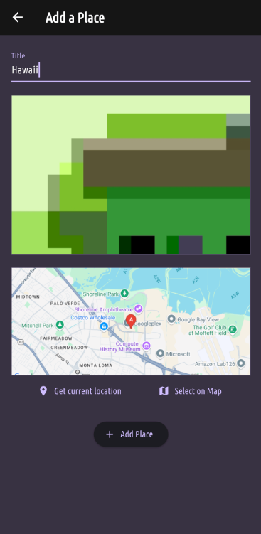
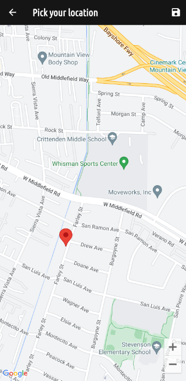
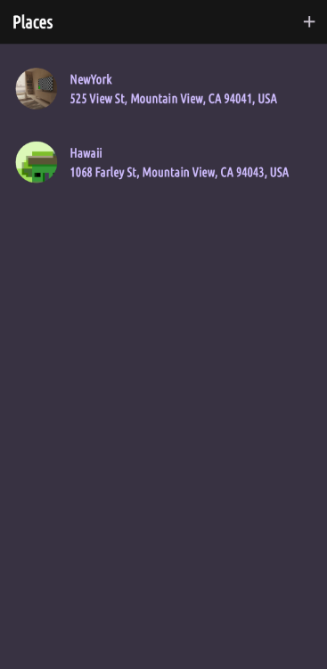

<h1>Favorite Places</h1>

"Favorite Places" is an app that allows users to capture memories by taking pictures and saving their location. Users can view their saved places on a map and easily access their favorite locations.

<h3>Screenshots</h3>

<table>
  <tr>
    <td></td>
    <td>The app's interface where users can capture a picture and select a location to mark it as a memory.</td>
  </tr>
  <tr>
    <td></td>
    <td>The Google Maps API in action, displaying the user's location on the map.</td>
  </tr>
  <tr>
    <td></td>
    <td>The list of all saved places, allowing users to browse through their memories.</td>
  </tr>
</table>
